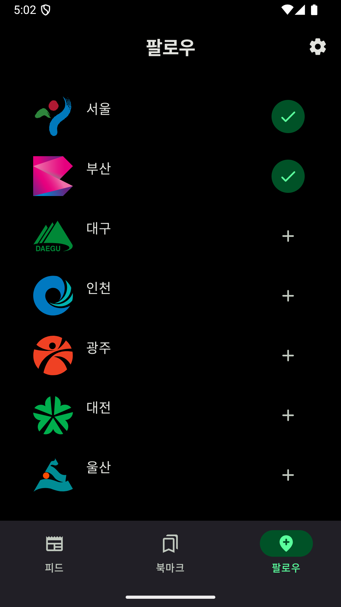

# 지역 알리미 애플리케이션
 

## 프로젝트 설명
이 애플리케이션은 공연 정보를 관리하고 조회할 수 있는 서버 애플리케이션입니다. Docker와 AWS EC2를 통해 배포되며, Spring Boot와 Kotlin으로 개발되었습니다.

## 기술 스택
- **백엔드**: Spring Boot (Kotlin)
- **데이터베이스**: PostgreSQL
- **배포 환경**: Docker, AWS EC2
- **기타**: QueryDSL, Swagger

## 메인화면

  
  
  

## 북마크,관심 지역 설정

  
  
  

## 관련 홈페이지 이동

  
  
  

## 시연영상
https://www.youtube.com/shorts/3QZfiWbzgts
